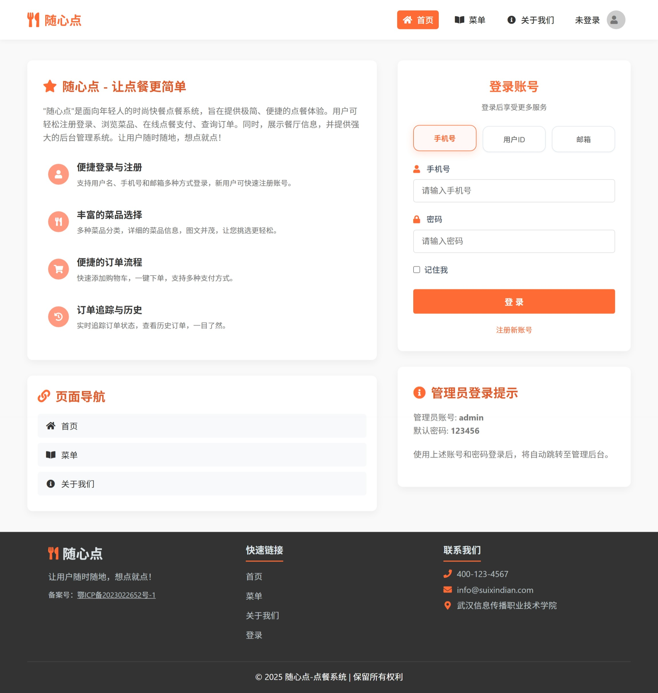
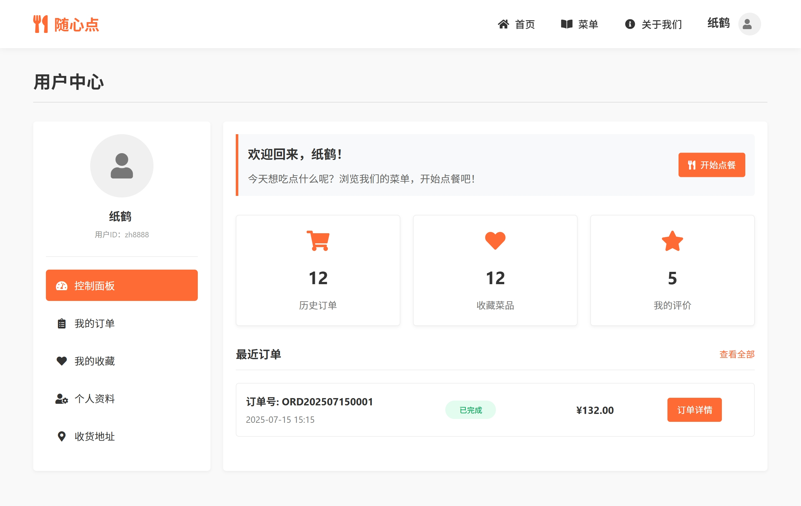
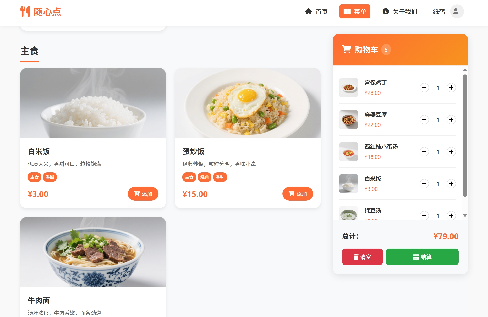
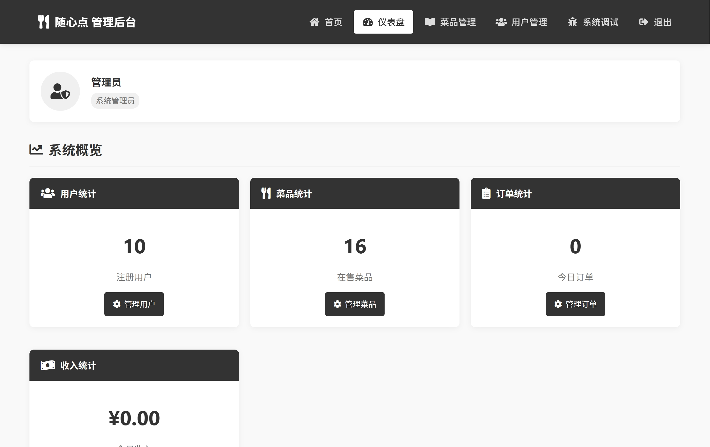
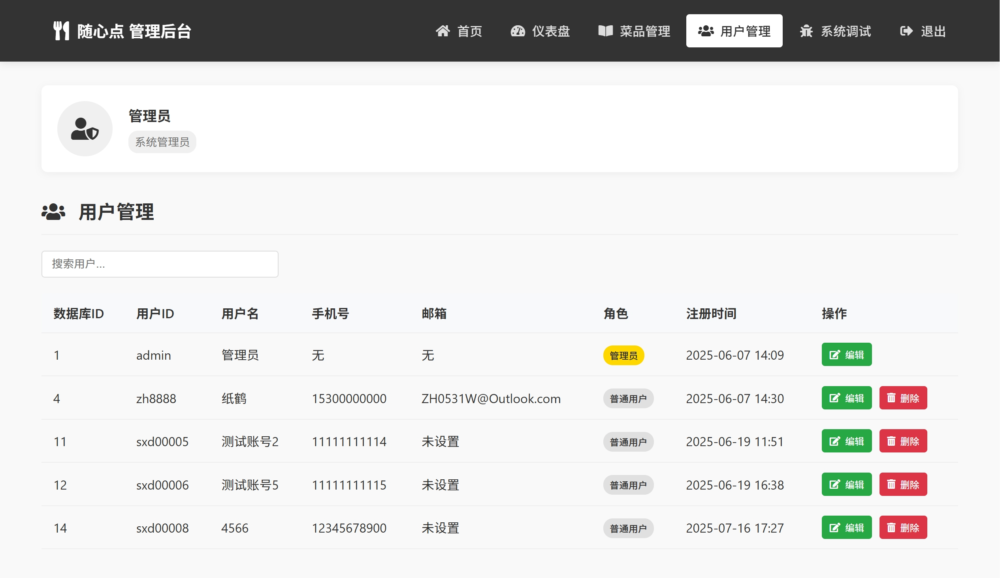
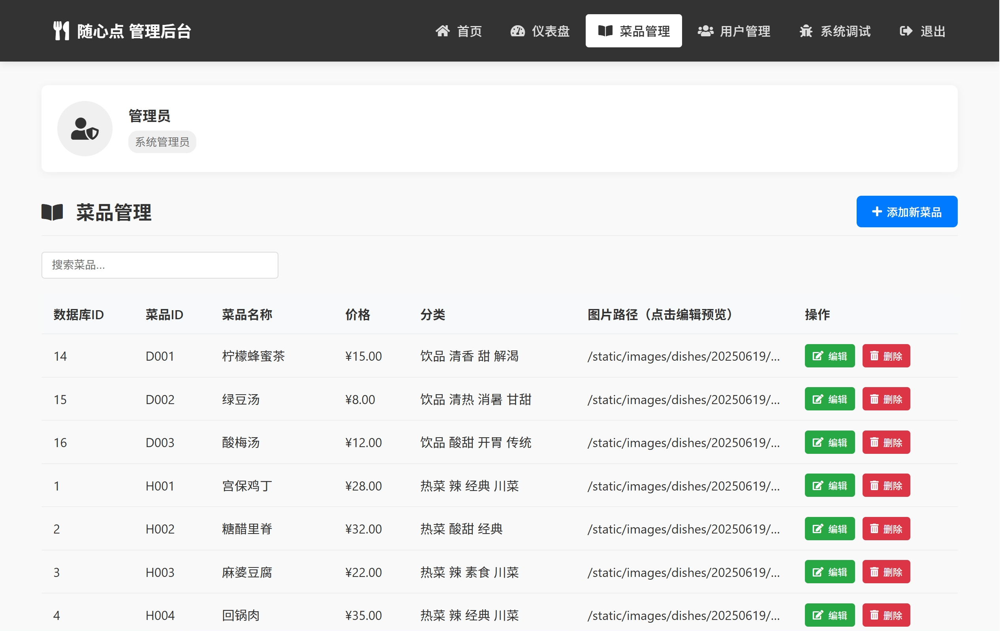

# 🍽️ 随心点 - 现代化餐厅点餐系统

[](https://www.oracle.com/java/)
[](https://spring.io/)
[](https://mybatis.org/)
[](https://www.mysql.com/)
[](https://tomcat.apache.org/)

> 🎯 **项目概述**：基于Java Web的餐厅点餐系统，实现了用户注册登录、菜品浏览、购物车管理、订单管理等功能，采用Spring+MyBatis+MySQL技术栈。

## 🌐 在线演示

🔗 **演示网站**：[https://zh8888.top](https://zh8888.top)

**测试账号**：
- 管理员：admin / 123456
- 用户：zh8888 / 123456

> 💡 在线演示网站可以直接体验完整功能，无需本地部署！

## 📋 目录

- [🌐 在线演示](#-在线演示)
- [🚀 项目亮点](#-项目亮点)
- [📋 功能特性](#-功能特性)
- [🎨 界面展示](#-界面展示)
- [🛠️ 技术栈](#️-技术栈)
- [⚡ 快速开始](#-快速开始)
- [🗂️ 项目结构](#️-项目结构)

## 🚀 项目亮点

- 🎯 **完整业务流程** - 从用户注册到下单的完整功能闭环
- 🔐 **多方式登录** - 支持手机号/用户ID/邮箱登录
- 🛒 **实时购物车** - 基于Session实现购物车功能
- 👥 **双端管理** - 用户端和管理端分离设计
- 📊 **数据统计** - 订单统计和收入分析功能
- 🚀 **简洁部署** - 支持根目录部署，访问更便捷

## 📋 功能特性

### 👤 用户端
- **用户管理** - 注册登录、个人信息管理
- **用户面板** - 个人中心、订单历史、数据统计
- **菜品浏览** - 菜品展示、详情查看
- **购物车** - 添加商品、数量调整、实时计算

### 🛠️ 管理端
- **数据统计** - 用户统计、订单统计、收入分析
- **用户管理** - 用户信息查看、状态管理
- **菜品管理** - 菜品增删改查、图片上传、分类管理

## 🎨 界面展示

### 用户端界面
<!-- 系统首页 - 展示登录和系统介绍 -->


<!-- 用户个人中心 - 展示个人信息和订单历史 -->


<!-- 菜品浏览页面 - 展示菜品列表和详情 -->


<!-- 购物车页面 - 展示菜品管理和结算 -->


### 管理端界面
<!-- 管理员数据面板 - 展示统计数据和系统概览 -->


<!-- 用户管理页面 - 展示用户列表和状态管理 -->


<!-- 菜品管理页面 - 展示菜品管理和图片上传 -->


## 🛠️ 技术栈

### 后端技术
- **Java 17** - 核心开发语言
- **Spring Framework 5.3.9** - 依赖注入和AOP
- **Spring MVC** - Web框架
- **MyBatis 3.5.7** - 持久层框架
- **MySQL 8.0** - 关系型数据库
- **Druid** - 数据库连接池

### 前端技术
- **HTML5/CSS3** - 页面结构和样式
- **JavaScript/jQuery** - 交互逻辑
- **Bootstrap** - 响应式UI框架
- **JSP** - 服务器端页面技术

### 开发工具
- **Maven** - 项目构建管理
- **Apache Tomcat 9.0** - Web应用服务器

## ⚡ 快速开始

> 🌐 **快速体验**：可以直接访问 [在线演示](https://zh8888.top) 体验完整功能！

### 1. 获取项目
```bash
git clone https://github.com/ZH0531/SuiXinDian_OrderSystem.git
cd SuiXinDian_OrderSystem
```

### 2. 数据库配置
```bash
# 登录MySQL
mysql -u root -p

# 执行数据库脚本
SOURCE SQL/init_database.sql;
```

### 3. 修改配置
编辑 `src/main/resources/application.properties`：
```properties
# 数据库配置
jdbc.url=jdbc:mysql://localhost:3306/restaurant
jdbc.username=root
jdbc.password=123456

# 文件上传路径
upload.path=C:/sxd/uploads
```

### 4. 启动项目
```bash
# 编译打包
mvn clean package

# 部署到Tomcat
cp target/ordering-system-1.0-SNAPSHOT.war $TOMCAT_HOME/webapps/

# 🎯 部署到根目录（可选，推荐生产环境使用）
cp target/ordering-system-1.0-SNAPSHOT.war $TOMCAT_HOME/webapps/ROOT.war

# 启动服务
$TOMCAT_HOME/bin/startup.sh
```

### 5. 访问系统
- **本地访问**：http://localhost:8080/ordering-system-1.0-SNAPSHOT/
- **根目录访问**：http://localhost:8080/ (如果使用ROOT.war部署，访问更简洁)
- **管理员账号**：admin / 123456
- **测试用户**：zh8888 / 123456

> 💡 **注意**：
> - 用户ID在注册时会自动生成（如 sxd00001），支持用户ID、手机号或邮箱登录
> - 使用ROOT.war部署可以通过 `http://localhost:8080/` 直接访问，无需项目名称

## 🗂️ 项目结构

```
SuiXinDian_OrderSystem/
├── src/main/
│   ├── java/com/zh8888/
│   │   ├── config/         # 配置类
│   │   ├── controller/     # 控制器
│   │   ├── dao/           # 数据访问层
│   │   ├── model/         # 实体类
│   │   └── service/       # 业务逻辑层
│   ├── resources/
│   │   ├── mapper/        # MyBatis映射文件
│   │   └── application.properties
│   └── webapp/
│       ├── static/        # 静态资源
│       └── WEB-INF/views/ # JSP页面
├── SQL/                   # 数据库脚本
└── pom.xml               # Maven配置
```

---

## 📞 联系方式

- 🐛 **问题反馈**：[GitHub Issues](https://github.com/ZH0531/SuiXinDian_OrderSystem/issues)
- 💬 **项目讨论**：[GitHub Discussions](https://github.com/ZH0531/SuiXinDian_OrderSystem/discussions)

---

<div align="center">

**⭐ 如果这个项目对您有帮助，请给我们一个Star！ ⭐**

Made with ❤️ by ZH0531

</div>
